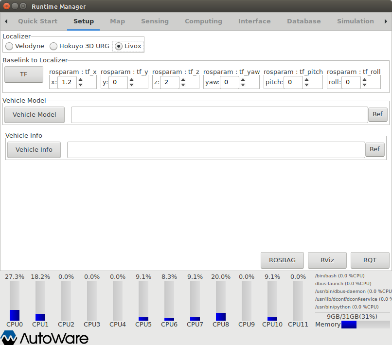
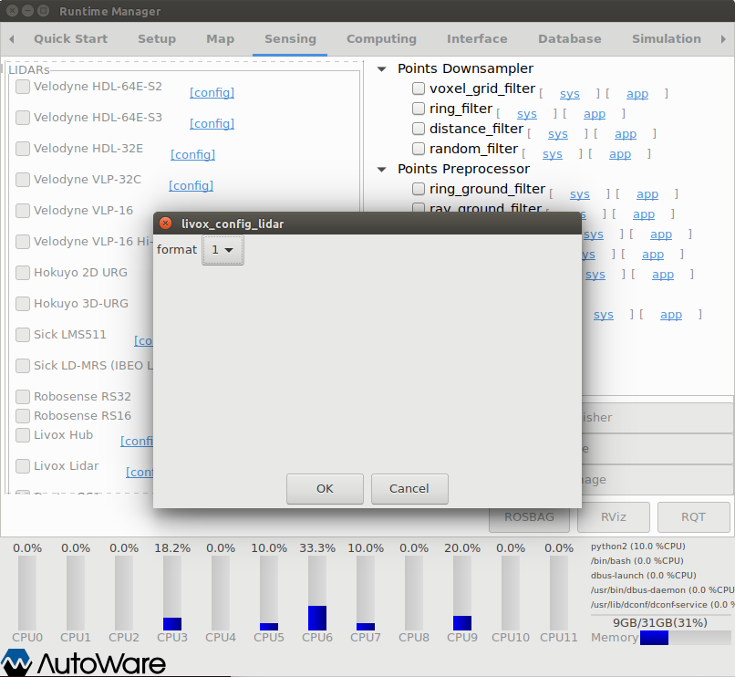
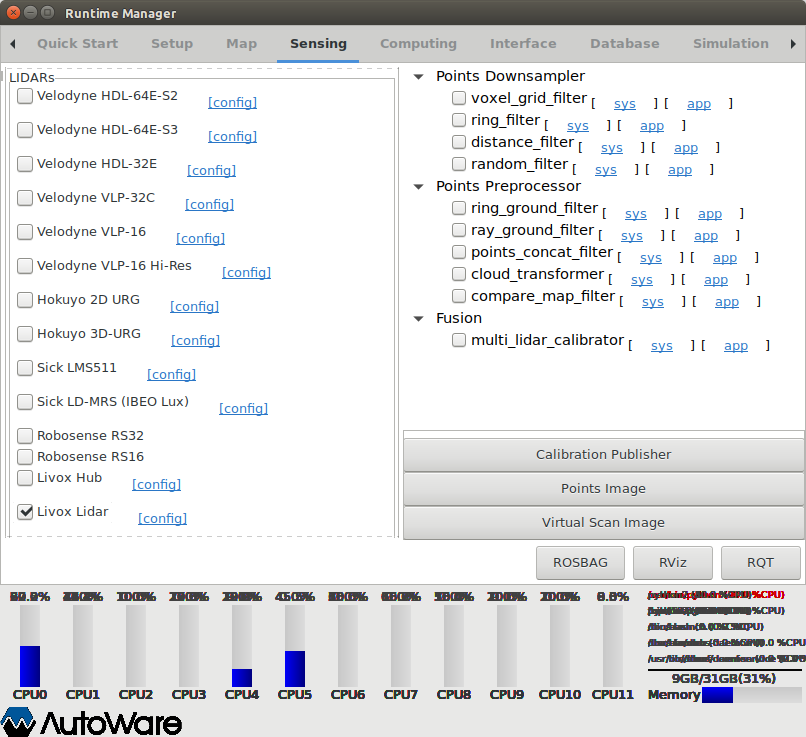
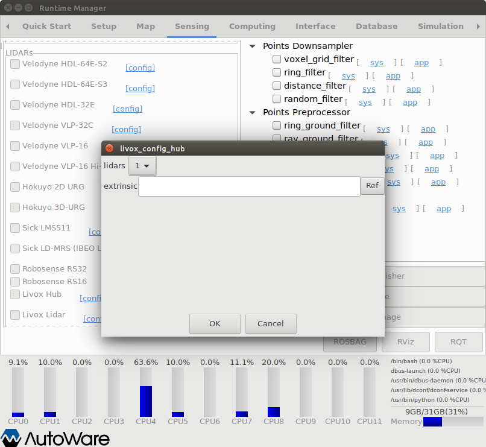
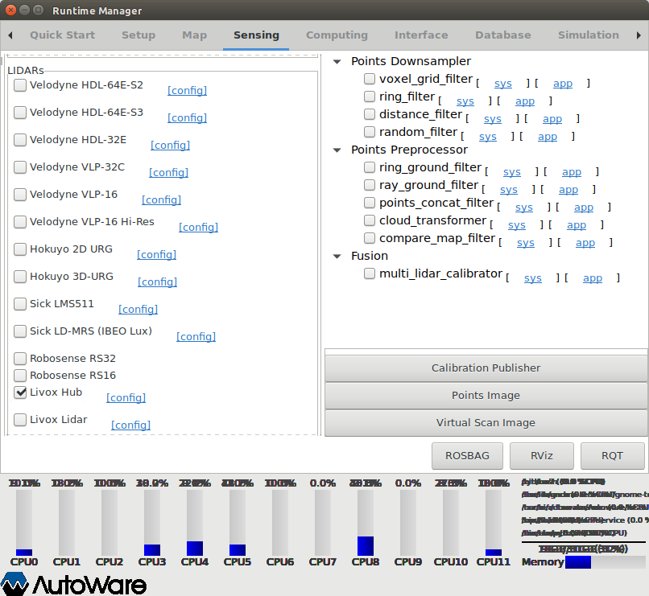

# Livox Autoware Driver

livox_autoware_driver is modified on the basis of [livox_ros_driver](https://github.com/Livox-SDK/livox_ros_driver) and adapts to the Autoware self-driving software. It allows users to start livox lidar or livox hub directly through Autoware runtime manager and can automatically synchronize multiple lidars when connecting livox hub.  

**Developer**: [Livox](https://www.livoxtech.com/)

## Installation

To install livox_autoware_driver, we strongly recommend using [Docker Method](https://github.com/Livox-SDK/livox_autoware_driver#1-install-from-docker). Otherwise, you can install it from source by following the [Source Method](https://github.com/Livox-SDK/livox_autoware_driver#2-install-from-source).

### 1. Install from Docker

- For docker installation, please consult [Docker's installation website](https://docs.docker.com/engine/installation/linux/docker-ce/ubuntu/).
- Download livox_autoware_driver:
    ```
    mkdir ~/livox_autoware_ws && cd ~/livox_autoware_ws
    git clone https://github.com/Livox-SDK/livox_autoware_driver.git
    ```
- Build the Docker Image: 
    > ***NOTE:*** If you need nvidia cuda surpport, please set 'FROM' command in [Dockerfile](https://github.com/Livox-SDK/livox_autoware_driver/blob/7db5ae3c18001abcefd264108ad1fe184b6f278e/Dockerfile#L1) to:  
    > `FROM autoware/autoware:latest-melodic-cuda`  
    > And set the `CUDA="off"` option in [run_livox.sh](https://github.com/Livox-SDK/livox_autoware_driver/blob/7db5ae3c18001abcefd264108ad1fe184b6f278e/run_livox.sh#L6) to:  
    > `CUDA="on"`

     ```
     cd ~/livox_autoware_ws/livox_autoware_driver/
     docker build -t autoware/livox:latest .
     ```

### 2. Install from Source

- Installing Autoware from source by following the [source build instructions](https://gitlab.com/autowarefoundation/autoware.ai/autoware/-/wikis/Source-Build).
- Download livox_autoware_driver:
    ```
    cd /YOUR_AUTOWARE_LOCATE_PATH/src/drivers/awf_drivers/
    git clone https://github.com/Livox-SDK/livox_autoware_driver.git
    ```
- Rewrite autoware runtime manager files:
    ```
    cd /YOUR_AUTOWARE_LOCATE_PATH/src/drivers/awf_drivers/livox_autoware_driver
    cp -f scripts/* /YOUR_AUTOWARE_LOCATE_PATH/src/autoware/utilities/runtime_manager/scripts/
    ```
- Rebuild autoware source files following the [instructions](https://gitlab.com/autowarefoundation/autoware.ai/autoware/-/wikis/Source-Build). For example, for 1.12.0 and Newer:  
    *With CUDA support*
    ```
    AUTOWARE_COMPILE_WITH_CUDA=1 colcon build --cmake-args -DCMAKE_BUILD_TYPE=Release
    ```
    *Without CUDA Support*  
    ```
    colcon build --cmake-args -DCMAKE_BUILD_TYPE=Release
    ```

## Run

### 1. Set Localizer

- Start the autoware runtime manager.  
    *For Docker Installation Method:*
    ```
    cd ~/livox_autoware_ws/livox_autoware_driver/
    sudo chmod +x run_livox.sh
    ./run_livox.sh
    roslaunch runtime_manager runtime_manager.launch
    ```
    *For Source Installation Method:*
    ```
    cd /YOUR_AUTOWARE_LOCATE_PATH/
    source install/setup.bash
    roslaunch runtime_manager runtime_manager.launch
    ```
- Set `Localizer` name to **Livox** :

    <div align="left">
        
    </div>

### 2. Start Livox Lidar
- Config livox lidar pointcloud format as described in [livox_ros_driver](https://github.com/Livox-SDK/livox_ros_driver#42-livox_ros_driver-internal-main-parameter-configuration-instructions) . You can select different formats by clicking **[ config ]** after the 'Livox Lidar':

    <div align="left">
        
    </div>

- Select 'Livox Lidar' in *Sensing/LIDARs* to start livox_autoware_driver, as shown below:

    <div align="left">
        
    </div>

- To check whether livox_autoware_driver startes correctly, you can open a terminal and check the topic type of '/points_raw'. The output type should be the same as the format you selected. Such as:
    ```
    $ rostopic type /points_raw
    sensor_msgs/PointCloud2
    ```
    or
    ```
    $ rostopic type /points_raw
    livox_ros_driver/CustomMsg
    ```

### 3. Start Livox Hub
- Set the number and extrinsic parameters of lidars inserted into the livox hub by clicking **[ config ]** after the 'Livox Hub':

    > ***NOTE:*** 
    > 1. The number of 'lidars' **must** be set equal to the number of lidars inserted into the livox hub.
    > 2. Multiple lidars must be inserted into hub slots in the order of 1, 2, 3..., and the slot number cannot be interrupted.
    > 3. If 'extrinsic' is not set, the extrinsic parameter of each lidar will be set to 'Identity' by default.
    > 4. An extrinsic config file should in the same format as [livox_autoware_driver/livox_ros_driver/config/extrinsic.csv](https://github.com/Livox-SDK/livox_autoware_driver/blob/master/livox_ros_driver/config/extrinsic.csv): the first row represents the parameter of the lidar inserted into the first hub slot and is arranged in the format of "roll, pitch, yaw, x, y, z,". The other rows are the same as the first row.

    <div align="left">
        
    </div>
- Select 'Livox Hub' in *Sensing/LIDARs* to start livox_autoware_driver, as shown below:

     <div align="left">
            
     </div>
 
- To check whether livox_autoware_driver startes correctly, you can open a terminal and check the topic type of '/points_raw'. The output type should be 'sensor_msgs/PointCloud2'. Such as:
    ```
    $ rostopic type /points_raw
    sensor_msgs/PointCloud2
    ```

## Support

You can get support from Livox with the following methods :

* Send email to dev@livoxtech.com with a clear description of your problem and your setup
* Report issue on github
